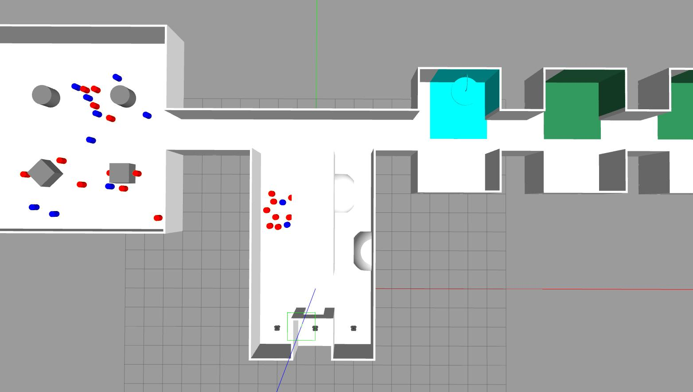

AURO'2025 Assessment ROS2 Package
---------------------------------
This package contains the simulation configuration for the AURO assessment. There
is one simulation environment ROS node, named `barrel_manager`, and two ROS nodes provided
per robot, named `visual_sensor` and `dynamic_mask`.

Note that for the assessment you are **not allowed** to change the ROS implementation
of the simulation environment, nor any files within the packages `assessment`, `assessment_interfaces` or 
`gazebo_ros_link_attacher`. You may also **not** change the definition of `ItemRequest.srv` in
the package `auro_interfaces`.

Your solution should be developed primarily within the `solution` package, but you 
**may create any additional ROS2 packages** as deemed necessary to your solution. 
Moreover, the `solution_launch.py` launch file must support all existing parameters, 
but you can add additional parameters.

Your scenarios should be defined in the `.devcontainer/devcontainer.json` as indicated
in the assessment brief, with parameters used to launch `solution_launch.py`. The tool
`rcutil.py` can be used to help you check that the `.devcontainer/devcontainer.json`
is configured correctly, and, among other commands, to zip the workspace for submission.

**Note:** While you are free to use any of the provided .devcontainer configurations (eg. auro-vnc, auro-wsl, or auro-linux) for development, it is your responsibility to ensure that for submission the `.devcontainer/devcontainer.json` (auro-vnc) is configured appropriately and that it executes properly.

# Task
Your implementation task, as described in the assessment paper, is to design and 
implement, an autonomous robotic system using TurtleBot3 Waffle Pi robots, running in 
simulation, that collect barrels in the arena and deposit them in collection zones
marked in green. 

## Barrels and zones
There are two types of **barrels**, identified by distinct colours: red for contaminated barrels,
and blue for non-contaminated barrels. Similarly, there is a **decontamination zone** marked in cyan.
A screenshot of a simulation launched using the default parameters is reproduced below:



### Towing barrels and offloading them
Barrels can be attached to a TurtleBot's back when sufficiently close enough and then calling the
ROS service `/pick_up_item`. Subsequent movement of the robot will tow the barrel while attached.
A barrel can be disconnected from the robot by using the ROS service `/offload_item`.
Details of the ROS facilities of the simulated environment are discussed further below.

### Depositing a barrel in a collection zone
For a barrel to be successfully deposited in a zone, the barrel must be deposited within the boundary
of a zone. The ROS service `/offload_item` will provide a response indicating whether this is the
case. You can also monitor the offloading of barrels by subscribing to a topic `/barrel_log`.

Barrels can otherwise be offloaded anywhere, but successful collection will only be counted when 
offloaded at a collection zone.

# Simulation environment
A valid solution to the problem can make use of multiple robots, where each robot is
identified by a unique identifier `robotX`, where `X` is a number. For example, the 
default launch file [solution_launch.py](../solution/launch/solution_launch.py) uses one robot, 
whose identifier is `robot1`.

## Simulation environment nodes
The functionality of the ROS nodes provided as part of the simulation environment and their ROS 
interfaces are described in detail below.

### barrel_manager
This node keeps track of barrels in the simulated arena, and of towing and unloading them as
requested. It also keeps track of contamination of a robot while towing a contaminated barrel.

It provides the ROS services `/pick_up_item` and `/offload_item`, for attaching and dettaching barrels
to a TurtleBot. Their interface type `ItemRequest` is defined in [../auro_interfaces/srv/ItemRequest.srv](../auro_interfaces/srv/ItemRequest.srv),
which must include in the request the identifier of the robot.

It also provides a ROS service `/decontaminate` that can be used when a robot is within the
decontamination zone (marked in cyan colour) to decontaminate a robot. Its interface type is 
also of type `ItemRequest` as defined in [../auro_interfaces/srv/ItemRequest.srv](../auro_interfaces/srv/ItemRequest.srv).

It also publishes the topics:
* `/barrel_log`: provides a log of how many barrels of each colour have been collected, so far.
* `/barrel_holders`: provides a view of the which barrel is held by what robot.
* `/radiation_levels`: provides a view of contamination levels for each known robot.

This node can be selectively disabled by toggling the launch parameter `barrels` of `solution_launch.py`.

## Robot nodes
The following nodes are executed per robot, namespaced according to the robot's identifier. For
example, the topic `barrels` will be available as the topic `/robot1/barrels` for `robot1`.

### visual_sensor
This node processes the RGB camera image data and identifies barrels and zones based on their colour.

It publishes the following topics:
* `barrels`: of type [`BarrelList`](../assessment_interfaces/msg/BarrelList.msg), it contains a list of the barrels 
  visible from the camera data, as processed by the sensor using OpenCV. For
  each barrel, recorded by the type [`Barrel`](../assessment_interfaces/msg/Barrel.msg) there is an estimate of its 
  relative offset with respect to the current view (x/y-axis), the perceived size and colour.
* `zones`: of type [`ZoneList`](../assessment_interfaces/msg/ZoneList.msg), it contains a list of the zones 
  visible from the camera data, as processed by the sensor using OpenCV. For
  each zone, recorded by the type [`Zone`](../assessment_interfaces/msg/Zone.msg) there is an estimate of its 
  relative offset with respect to the current view (x/y-axis), the perceived size and colour.
* `camera/image_barrels`: of type `Image`, it contains the camera image with the information about the visible
  items superimposed for debugging purposes. This is turned off by default, but can be enabled by setting the
  launch parameter `vision_sensor_debug` to `true`.
* `camera/image_zones`: of type `Image`, similarly, contains the camera image with information about the visible
  zones superimposed for debugging purposes (only available if `vision_sensor_debug` is set to `true`).
* `camera/image_zones_mask`: of type `Image`, similarly, contains the camera image with information about the mask used for 
  image processing for debugging purposes (only available if `vision_sensor_debug` is set to `true`).

The node supports the following launch parameters passed to `solution_launch.py`:
* `vision_sensor_debug`: boolean, determines whether `camera/image_barrels`, `camera/image_zones` and `camera/image_zones_mask` are published. By default it is set to `false` to minimise processor time.
* `vision_sensor_skip_frames`: boolean, determines whether frames that are similar are skipped from being processed. By default this is set to `true` to minimise processor time.
* `vision_sensor_frame_divider`: float, specifies what percentage of frames are to be processed. By default this is set to `0.5`, indicating that only half of the frames are processed. At a default of 23 frames per second, this can save significant processor time without incurring significant latency.

This node can be selectively disabled for all robots by toggling the launch parameter `vision_sensor` of `solution_launch.py`.

### dynamic_mask
This nodes provides the ability to filter a range of angles from LiDAR data. It does this by
subscribing to `scan` and publishing the same message on topic `scan_filtered`, but filtered, whereby 
angles between `ignore_sector_start` and `ignore_sector_end` are set to infinity.

It supports the following parameters, that can be changed at runtime:

* `ignore_sector_start`: integer, starting angle to ignore. By default it is set to `145`.
* `ignore_sector_end`: integer, ending angle to ignore. By default it is set to `206`.
* `mask_enabled`: boolean, whether to enable or disable filtering. By default is set to `false`.

[Nav2](https://docs.nav2.org/), if used, is configured to take LiDAR data from `scan_filtered`, rather than directly from `scan`.
Similarly, the default configurations provided for RViz2 also use `scan_filtered`.

## Launch files (solution_launch.py)
A simulation can make use of multiple robots, whose starting positions are pre-defined
in [config/initial_poses.yaml](../solution/config/initial_poses.yaml). You are encouraged to check
in detail the paraemters supported by the launch file [solution_launch.py](../solution/launch/solution_launch.py), eg. by running `ros2 launch solution solution_launch.py --show-args`.
In particular, the following options may be useful to specify different simulation scenarios:

* `barrels` : Configures whether to launch the `barrel_manager` node.
* `experiment_duration` : How to long to run the simulation for (specified in seconds of simulation time) before terminating the simulation automatically. By default this is set to 840 seconds of simulation time.
* `initial_pose_package` : Allows changing the ROS package in which to look for the default pose configuration of the robot(s).
* `initial_pose_file` : Allows changing the yaml file containing the initial pose configuration of the robot(s), where this is relative to the package name passed to `initial_pose_package`.
* `num_robots`: Number of robots to spawn.
* `obstacles`: Whether the world contains obstacles in the large room.
* `odometry_source` : Configures whether to use WORLD or ENCODER data as odometry source.
* `random_seed` : Random number seed for barrel manager, controlling the distribution of items.
* `rviz_log_level` : The level of messages to print on the command line in relation to RViz (default: warn, possible values: error, info, warn)
* `sensor_noise` : Whether to enable sensor noise (applies to camera, LiDAR, and IMU).
* `use_nav2` : Whether to use the [ROS2 Nav2 stack](https://docs.nav2.org/). Specifying this parameter also configures RViz2, by default, to use the correct visualisation that includes Nav2 data and controls.
* `use_rviz` : Whether to launch RViz2.
* `visualise_sensors` : Whether to visualise LiDAR and camera data in Gazebo. This is completely optional.
* `wait_for_barrels` : Whether to wait for all barrels to be spawned before spawning the TurtleBots in the arena.

Options related to the visual sensor are described above.

The simulation may be executed headless and faster than real-time, by controlling the following paremters:

* `headless` : Whether to run the Gazebo visualisation GUI. A simulation can be executed headless.
* `limit_real_time_factor` : Whether to limit the Gazebo real-time factor to 1.0. If this is set to false, then a simulation can be executed faster than real-time.

A sample data logger is provided, that you are encouraged to use and extend for your experiments. Related
launch parameters include:

* `data_log_path` and `data_log_filename` : Together, they define which file to log data to using the provided [data_logger.py](../solution/solution/data_logger.py).

## Sample solution schema
A minimal code schema for a potential solution is included in the package [`solution`](../solution/). Your
solution must be launched using the [`solution_launch.py`](../solution/launch/solution_launch.py) file. That
file reuses the launch file `assessment_launch.py`, that launches the simulation environment. For your submission,
[`solution_launch.py`](../solution/launch/solution_launch.py) must support all existing parameters, but you may
add new parameters and change the launch file as deemed necessary to implement your solution.

### Scenarios
Scenarios for exercising your solution should be specified in the [.devcontainer/devcontainer.json](../../.devcontainer/devcontainer.json) file, following the structure outlined below:

```
{
    ...
    "customizations": {
        "auro": {
            // "apt" : [ "some-apt-package" ],
            // "pip" : [ "some-pip-package" ],
        "scenarios" : [
            {
                "name": "Scenario 1",
                "description": "Basic scenario with two robots and no sensor_noise, and without running rviz.",
                "parameters": {
                    "use_rviz": "false",
                    "num_robots": 2,
                    "sensor_noise": "false"
                }
            },
            {
                "name": "Scenario 2",
                "description": "Basic scenario with three robots and no sensor_noise, and without running rviz.",
                "parameters": {
                    "use_rviz": "false",
                    "num_robots": 3,
                    "sensor_noise": "false"
                }
            }
        ]
        }
    } 
}
```

## Additional apt and pip packages
Additional apt and pip packages, if needed, should be specified in the [.devcontainer/devcontainer.json](../.devcontainer/devcontainer.json) file, following the structure outlined above. They can be automatically installed using the command `./rcutil.py install-dependencies`, which is how additional packages will installed, upon evaluating your submitted solution.

## rcutil.py - Checking your ROS2 workspace before submission!
You are encouraged to make use of the utility [rcutil.py](../rcutil.py) to help with checking that your
submission is consistent and reproducible. The utility can help with buidling a workspace, cleaning it,
installing dependencies specified in the [.devcontainer/devcontainer.json](../.devcontainer/devcontainer.json)
file, as well as, list scenarios, execute them, and package the workspace as a ZIP file.

Of particular importance is the subcommand `check-submission`. Further details are available using
its help command, as illustrated below:

```
$ ./rcutil.py -h
usage: rcutil.py [-h] {build,check-submission,check-zip,clean,install-dependencies,list-launch,list-scenarios,run-scenario,zip-workspace} ...

AURO2025 assessment workspace CLI tool [version: 1.0]

positional arguments:
  {build,check-submission,check-zip,clean,install-dependencies,list-launch,list-scenarios,run-scenario,zip-workspace}
                        Subcommands
    build               Build a ROS 2 workspace
    check-submission    Check if workspace is consistent prior to submission
    check-zip           Check if a ZIP file is a ROS 2 workspace
    clean               Clean ROS2 workspace
    install-dependencies
                        Install apt/pip dependencies as specified in devcontainer.json file
    list-launch         List launch files and their arguments
    list-scenarios      List all scenarios defined in devcontainer.json file
    run-scenario        Run a scenario specified in the devcontainer.json file
    zip-workspace       Create a ZIP archive of the workspace, omitting .git and build folders.

options:
  -h, --help            show this help message and exit
```
